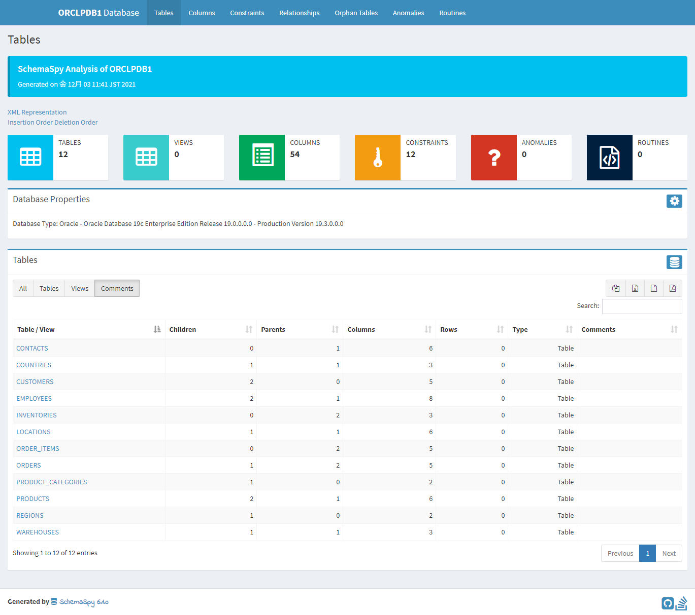

# Docker + Oracle 19c + 公式サンプルデータ + ER図自動生成

## 概要

Docker で Oracle 19c を動かし、起動スクリプトでサンプルデータを流し込んだ上で、ER図の自動生成ツールを導入する。

- Docker はインストール済み
- Oracle にユーザ登録して、DB の Zip ファイルをダウンロード
- Oracle が提供する Docker ビルドツールで Oracle 19c のコンテナイメージをビルド
- 起動スクリプトでユーザ作成、スキーマ作成、データ投入が自動でできるようにする
- SchemaSpy で ER 図を生成する

最終的に表示されるドキュメントは GitHub Pages で公開する。

## Oracle Database を入手する

Oracle のデータベースは高いが、個人で勉強する分には無料でデータベースを使える。

無料でデータベースを使用する方法はいくつかあるが、手軽に使えるのは OTN ライセンスか、Express Edition となる。

今回は、OTN ライセンスで進める。

### OTN ライセンス

Oracle Technology Network ライセンスの略称。

利益を生まない個人利用の範疇で使って良いが、Database に関わるコードやもろもろを第三者に公開するな、
という制約がついている。

つまり、ここで作成した Docker Image は絶対に公開してはいけない。

### Express Edition XE

その名が示すとおり簡易版の DB のこと。
性能面の制限に加え、機能制限されているが、商用でも利用することが可能。

### Oracle にユーザ登録

Oracle のサイトからユーザ登録をしておく。

Oracle プロファイルの作成:  
https://profile.oracle.com/myprofile/account/create-account.jspx

個人として利用するので、会社名は個人名で良い。登録すると認証メールが届くので、認証を完了させる。

### DB をダウンロードする

Oracle のサイトから DB の Zip ファイルをダウンロードする。

Oracle Database ソフトウェア・ダウンロード:  
https://www.oracle.com/jp/database/technologies/oracle-database-software-downloads.html

Docker で利用するので、Oracle Database 19c の Linux x86-64 版の Zip ファイルをダウンロードする。

## Oracle DockerImage を利用する

ダウンロードした DB を Docker Image にするには、公式のビルドツールが必要となる。

oracle/docker-images:  
https://github.com/oracle/docker-images

git clone コマンドでビルドツールを入手する。

`ビルドツールを入手: `
``` console
git clone https://github.com/oracle/docker-images
```

git clone でコードを入手するとたくさんのディレクトリが含まれていることが分かる。

`ディレクトリ内を確認: `
``` console
ls
```

`実行結果: `
``` 
Archive                   OracleAccessManagement    OracleIdentityGovernance  OracleUnifiedDirectorySM
CODEOWNERS                OracleBI                  OracleInstantClient       OracleWebCenterContent
CODE_OF_CONDUCT.md        OracleCloudInfrastructure OracleJava                OracleWebCenterPortal
CONTRIBUTING.md           OracleCoherence           OracleLinuxDevelopers     OracleWebCenterSites
Contrib                   OracleDatabase            OracleOpenJDK             OracleWebLogic
GraalVM                   OracleFMWInfrastructure   OracleRestDataServices    README.md
LICENSE                   OracleGoldenGate          OracleSOASuite
NoSQL                     OracleHTTPServer          OracleUnifiedDirectory
```

必要なのはこの中で OracleDatabase のみ。他は削除して良い。

`OracleDatabase ディレクトリを1つ上の階層に移動させて他を削除する: `
``` console
mv ./OracleDatabase
cd ..
rm -rf ./docker-images
```

### イメージの作成

ダウンロードした DB を `OracleDatabase/SingleInstance/dockerfiles/${db-version}` に持っていく。

`現在地を確認: `
``` console
pwd
```

`実行結果例: `
```
/c/Users/yamada/workspace/OracleDatabase
```

`DB ファイルを移動させる: `
``` console
mv ~/Downloads/LINUX.X64_193000_db_home.zip ./SingleInstance/dockerfiles/19.3.0/
```

`移動結果を確認する: `
``` console
cd ./SingleInstance/dockerfiles
ls
```

`実行結果例: `
```
11.2.0.2               12.2.0.1               18.4.0                 buildContainerImage.sh
12.1.0.2               18.3.0                 19.3.0
```

今回の場合、ビルドしたいのは Enterprise Edition and Standard Edition 2 なので、次のコマンドを実行する。

`DB コンテナをビルドする: `
``` console
./buildContainerImage.sh -v 19.3.0 -e -i
```

なお、ダウンロード/ストレージ要領を GB 単位で消費される。
ビルドのために CPU リソースも大幅に占有される。
PC のスペックにもよるが、標準的な開発 PC でのビルドには、7分程度の時間が掛かる。

ビルドが完了したら、イメージを確認する。

`イメージサイズの確認: `
``` console
docker images
```

`実行結果: `
```
REPOSITORY        TAG         IMAGE ID       CREATED         SIZE
oracle/database   19.3.0-ee   69a61a55a4ad   8 minutes ago   6.53GB
```

## 起動スクリプトを設定する

``` console
mkdir ./build-and-run-oracle-19c-on-docker
cd ./build-and-run-oracle-19c-on-docker
mkdir ./oradata
touch ./docker-compose.yml
touch ./.env
```

docker-compose.yml の内容は以下の通りにする。

`docker-compose.yml`
``` yaml
version: '3.8'
services:
  db:
    image: oracle/database:19.3.0-ee
    container_name: oracle
    ports:
      - 1521:1521
      - 5500:5500
    volumes:
      - ./oradata:/opt/oracle/oradata
      - ./startup:/opt/oracle/scripts/startup
    environment:
      - ORACLE_PDB=${ORACLE_PDB}
      - ORACLE_PWD=${ORACLE_PWD}
      - ORACLE_CHARACTERSET=${ORACLE_CHARACTERSET}
```

.env ファイルには次のように設定値を記載する

`.env への記載例: `
```
ORACLE_PDB=ORCLPDB1
ORACLE_PWD=oracle19cPass
ORACLE_CHARACTERSET=AL32UTF8
```

なお、Docker に対して十分な量のメモリを設定しておく必要がある。
4GB 程度は必要となる。2GB 以下だとログに警告が表示される。

### 初期化 DDL/DLL の実行

Oracle 向けのサンプルデータが公開されているのでこれを利用する。

Oracle Sample Database:  
https://www.oracletutorial.com/getting-started/oracle-sample-database/

### PDB について

Oracle は 12c 以降、CDB（コンテナ DB）と PDB（プラガブル DB）という概念を持っている。

今回のデータ投入時に操作したいのは、このうち PDB のほうなので、
次の ALTER 文でセッションを CDB から PDB に切り替える。

`PDB にセッションを切り替える: `
``` sql
ALTER SESSION SET CONTAINER = ORCLPDB1;
```

ユーザ作成 DDL では、パスワードを設定してユーザを作成する。

`ユーザ作成の構文: `
``` sql
CREATE USER ユーザ名 IDENTIFIED BY パスワード
```

`ユーザ作成例: `
``` sql
-- Create new user
CREATE USER HARDWARE_SHOP IDENTIFIED BY oracle;
```

このようにすることで、作成した DBA アカウント HARDWARE_SHOP で schema の作成などが行えるようになる。

`DBA アカウントでの接続例: `
``` sql
ALTER SESSION SET CONTAINER = ORCLPDB1;
CONNECT HARDWARE_SHOP/oracle@ORCLPDB1
```

startup ディレクトリ内の SQL ファイルが実行される形になるので、以下のようなディレクトリ構成にする。

```
├── docker-compose.yaml
├── oradata
│   └── ot_drop.sql
└── startup
    ├── 01_hs_create_user.sql
    ├── 02_hs_schema.sql
    └── 03_hs_data.sql
```

### 各 SQL ファイルの内容

- [01_hs_create_user.sql](./startup/01_hs_create_user.sql)
- [02_hs_schema.sql](./startup/02_hs_schema.sql)
- [03_hs_data.sql](./startup/03_hs_data.sql)
- [hs_drop.sql](./oradata/hs_drop.sql)

### DB の作成

docker-compose することで DB の構築がスタートする。

``` console
docker-compose
```

バックグラウンドで起動させるには `-d` オプションを付ける。

``` console
docker-compose up -d
docker logs -f oracle
```

ビルド時よりも時間が掛かるので、暇な時にやるようにする。

docker stats を実行すると、resource の使用状況が分かる。

``` console
docker stats
```

`DATABASE IS READY TO USE!` が表示されたら DB の構築は完了している。

### A5M2 への接続

次の情報で A5M2 に接続する。
サービス名は PDB にして、プラガブル DB のほうに接続できるようにする。

`A5M2 接続情報: `

| 項目       | 設定値        |
| :--------- | :------------ |
| ホスト名   | localhost     |
| ポート番号 | 1521          |
| サービス名 | ORCLPDB1      |
| ユーザーID | system        |
| パスワード | oracle19cPass |

## SchemaSpy

SchemaSpy は DB のテーブル情報、リレーション情報、PL/SQL のコードなどを可視化した
ドキュメントを自動生成してくれるツール。

SchemaSpy:  
https://github.com/schemaspy/schemaspy

### 実行ファイルの用意

まずは Release されている jar ファイルをダウンロードする。

Releases · schemaspy/schemaspy:  
https://github.com/schemaspy/schemaspy/releases

適当なディレクトリを作成し、ダウンロードした jar ファイルを入れる。

### 設定ファイルの用意

SchemaSpy は、実行ファイルと同階層にある設定ファイル（schemaspy.properties）をロードしてくれる。

schemaspy.properties に次の通り、DB への接続方法を記載する。

`schemaspy.properties`
``` properties
schemaspy.t=orathin-service
schemaspy.dp=drivers

schemaspy.host=127.0.0.1
schemaspy.port=1521
schemaspy.db=ORCLPDB1
schemaspy.u=HARDWARE_SHOP
schemaspy.p=oracle
schemaspy.o=schemaspy
schemaspy.cat=%
```

### ドライバの用意

設定ファイルに記述した schemaspy.dp は、DB への接続にしようするドライバを格納したディレクトリを指す。

以下から使用する DB に適合した JDBC ドライバをダウンロードする。

JDBC and UCP Downloads page:  
https://www.oracle.com/database/technologies/appdev/jdbc-downloads.html

例えば、DB が 19.3 であれば、以下からダウンロードする。

Oracle JDBC and UCP 19c (19.12) Download page:  
https://www.oracle.com/database/technologies/appdev/jdbc-ucp-19-12-c-downloads.html

次のコマンドで使用している Java を調べる。

``` console
java --version
```

`実行例: `
```
openjdk 11.0.13 2021-10-19 LTS
OpenJDK Runtime Environment Microsoft-27990 (build 11.0.13+8-LTS)
OpenJDK 64-Bit Server VM Microsoft-27990 (build 11.0.13+8-LTS, mixed mode)
```

この場合は、ダウンロードページで `Certified with JDK10 and JDK11` となっている、ojdbc10.jar を利用する。

### ER 図の自動生成

ここまでの作業で、ディレクトリ構造は次のようになっている。

```
.
├── drivers
│   └── ojdbc10.jar
├── schemaspy-6.1.0.jar
└── schemaspy.properties
```

次のコマンドで SchemaSpy を実行してみる。

``` console
java -jar schemaspy-6.1.0.jar -vizjs
```

`実行結果: `
```
  ____       _                          ____
 / ___|  ___| |__   ___ _ __ ___   __ _/ ___| _ __  _   _
 \___ \ / __| '_ \ / _ \ '_ ` _ \ / _` \___ \| '_ \| | | |
  ___) | (__| | | |  __/ | | | | | (_| |___) | |_) | |_| |
 |____/ \___|_| |_|\___|_| |_| |_|\__,_|____/| .__/ \__, |
                                             |_|    |___/

                                              6.1.0
```

オプションが多数用意されている。

例えば、`-nopages` オプション尾を利用すると、カラム表示の時のページングが無効化されて見通しが良くなる
（デフォルトは 10 カラム表示でページングありになっている）。

うまく実行できれば、INFO ログが表示されていく。

動作が完了すると、schemaspy というディレクトリが出現する。
これが DB の HTML ドキュメントになっている。

```
.
├── drivers
│   └── ojdbc10.jar
├── schemaspy
├── schemaspy-6.1.0.jar
└── schemaspy.properties
```

以下のコマンドでページを表示する

``` console
open schemaspy/index.html
```

デフォルトのブラウザで HTML ドキュメントが表示される。

`SchemaSpy テーブル一覧`


`SchemaSpy ER図`

